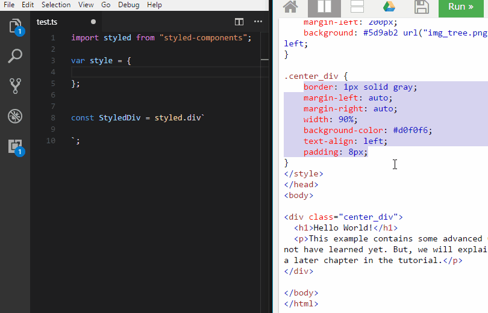

# css2react README

## Features

Convert the current selection between CSS and React's inline style syntax. 

## See It in Action



## Usage

Select the lines you want to convert and press Cmd+Option+c on Mac (Ctrl+Alt+c on Windows). Conversion works both ways, CSS to React inline and back.

## Customization
You want to use a different shortcut? No problem. Remap it by putting this into your keybindings.json

```
{
    "key": "ctrl+alt+y",
    "command": "extension.css2react",
    "when": "editorTextFocus"
}
```

## Known Issues

Converted code might need some editing but should be a good start.

## Release Notes

### 0.0.1

Initial release of css2react

**Enjoy!**